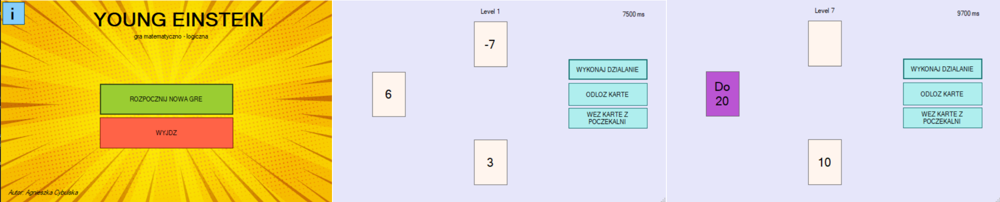

# Young Einstein written in Windows Forms C#
## Table of contents
* [Description](#description)
* [Rules](#rules)
* [Overview](#overview)
* [Technologies](#technologies)

## Description
Project is a game designed especially for kids that have a problems with learning and concentration. 
The aim of the project is to learn mathematics and logic through play. 
The game consists in performing exercises in the field of addition and subtraction and making informed decisions by proper card management.
The expected effect is the ability to quickly perform simple mathematical operations in memory.

## Rules
* The user moves the action card to the result card or to the card lobby by pressing the appropriate button.
* There can only be one card in the card lobby.
* Only numbers between 0 and 20 can be displayed on the result card - if the result of the calculation exceeds this range, the user loses.
* After level 5, magic cards appear (like card "to 10"), the use of which changes the number of score to the number specified by the card.
* The user can save the game level and continue playing the next time the application is launched.

## Overview

## Technologies
Project is created with Windows Forms C#.